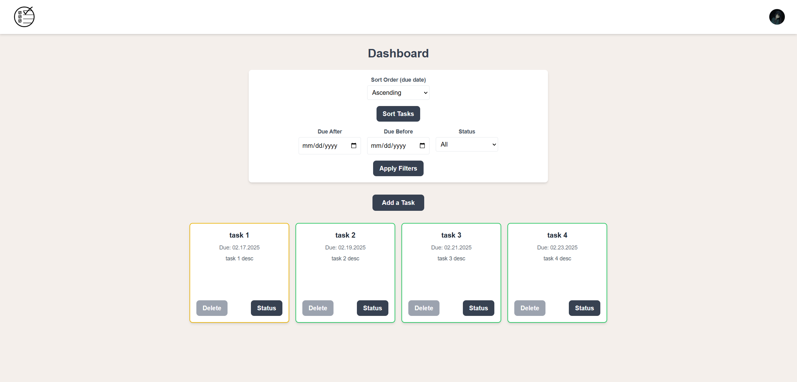
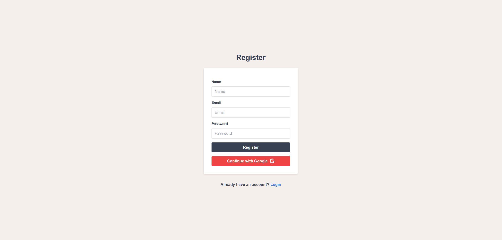
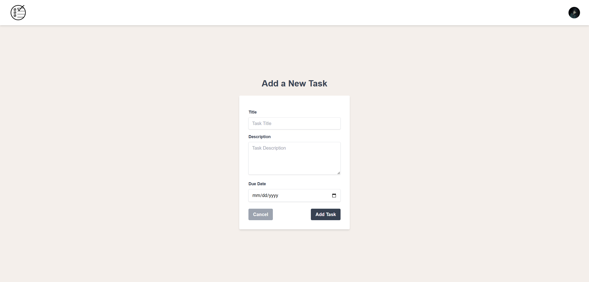
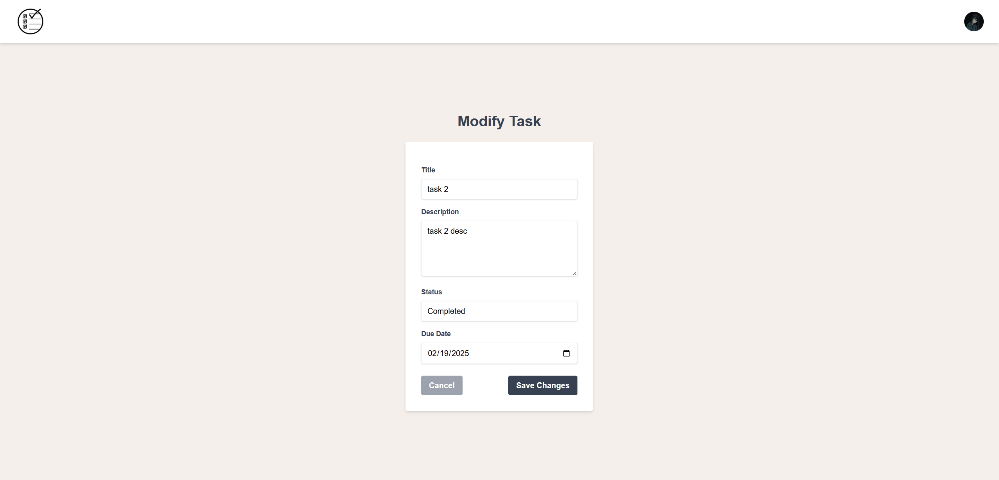
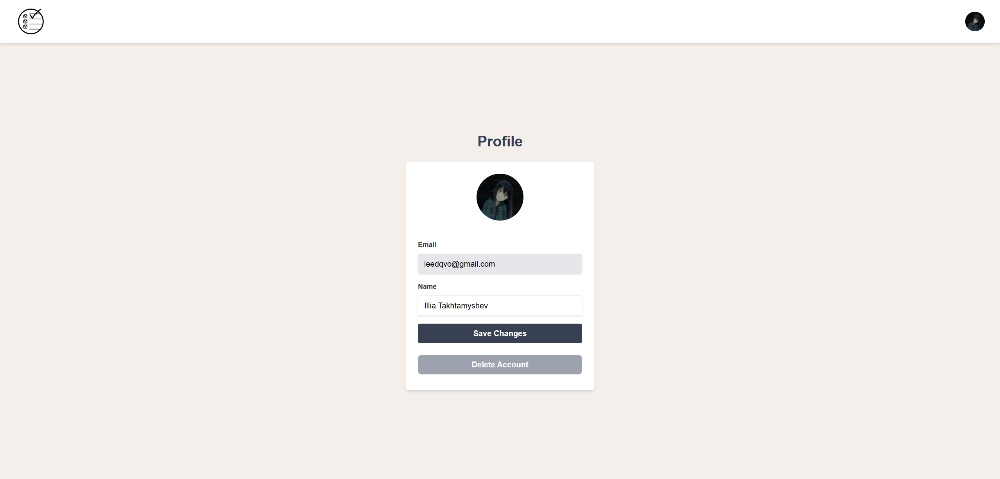
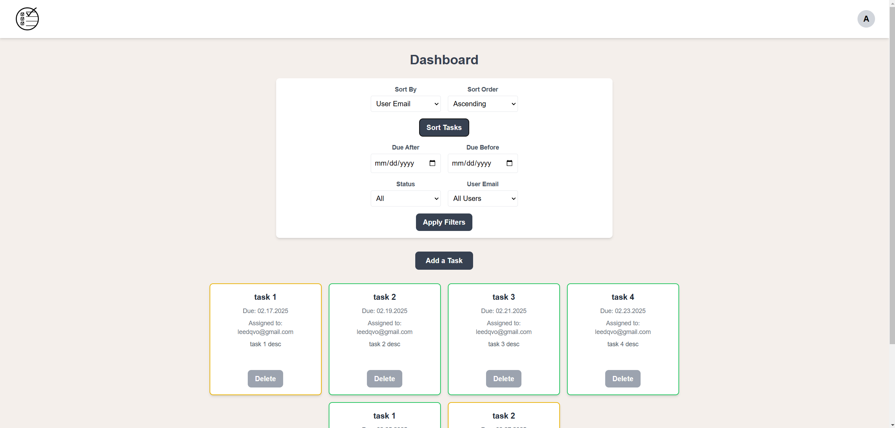
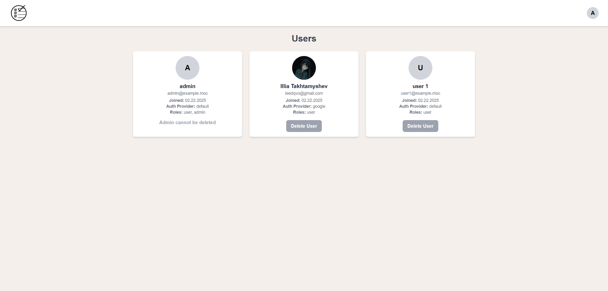

# Task Manager X

## Project Scope and Objectives

### Introduction
Task Manager X is a full-stack task management application developed primarily with **Spring Boot**. It showcases robust backend capabilities—including secure authentication and RESTful API design—while also featuring a responsive **React** front-end built with Tailwind CSS. This project demonstrates my full-stack development skills and my ability to build scalable, secure applications.

**Core Functionalities**:
* CRUD operations.
* Standard authentication (email/password) and Google OAuth2-based authentication. 
* Role-based access control with distinct user and admin functionalities. 
* Persistent task storage using an H2 in-memory database (with Flyway migrations).  
* Filtering and sorting of tasks based on status and due dates.  

**Target Audience:**  
 * General users who need an organized task management solution.

**Success Criteria:**  
* Users can log in using standard credentials or via Google OAuth2.  
* Users can create, update, delete, and mark tasks as completed.  
* Admins can manage (view, reassign, delete) all users’ tasks and manage users.  
* Data persists across sessions and is secured using JWT and Spring Security.

## Table of Contents
* **[Video Demo](#video-demo)**
* [Tech Stack Selection](#tech-stack-selection)
* [Functional Requirements](#functional-requirements)
* [Non-Functional Requirements](#non-functional-requirements)
* [Application Architecture](#application-architecture)
* [Dependencies](#dependencies)
* [Entities and Relations](#entities-and-relations)
* [API Design](#api-design)
* [Implementation Plan](#implementation-plan)
* [Screenshots](#screenshots)

## Video Demo

Watch a full walkthrough of Task Manager X, showcasing all major features:

### **[Watch Task Manager X Demo](https://youtu.be/m9z_4xBTHw0)**

### What’s Covered in the Video:
* User authentication (Standard & Google OAuth2)  
* Viewing, creating, editing, and deleting tasks
* Filtering and sorting tasks  
* Admin panel for task and user management  
* Session persistence with JWT authentication

## Tech Stack Selection  

### Backend:
* Spring Boot (API & server logic)
* Spring Security + OAuth2 (Authentication and authorization)
* JWT (Token-based authentication)  
* H2 Database (Lightweight in-memory storage)  
* REST API (Communication with the frontend)  
* Flyway (Database migrations)  

### Frontend: 
* React.js (UI framework)  
* Tailwind CSS (Styling)  
* React Router (Navigation)  
* React Hooks (State Management)  
* Vite (Build tool for fast development)  

### Tools & DevOps: 
* Git & GitHub (Version control)  
* Postman (API testing)

## Functional Requirements  

### User Features 
* **Authentication:** 
    * Standard email/password registration and login.  
    * Google OAuth2 login and registration.  
* **Task Management:**  
    * View tasks.
    * Add a new task.
    * Edit any task (or mark tasks as completed).
    * Delete any task.  
    * Filter tasks by status and due date ranges.  
    * Sort tasks by due date.  
* **Session Persistence:**  
    * User sessions and tasks are stored in an H2 database.  
    * JWT tokens are used for authentication.  
* **Responsive UI:**  
    * The app is fully responsive and works on both desktop and mobile devices.  
* **User Profile:**  
    * Basic user information is displayed and can be updated (name and password).  
    * Account deletion is available (with a confirmation modal).

### Admin Features
* **Task Administration:**  
    * View all tasks across all users.
    * Add a new task and assign it to any user.
    * Edit and reassign tasks to different users.  
    * Delete any task of any user.
    * Filter tasks by status, due date ranges and by user email.  
    * Sort tasks by due date and by user email.
* **User Management:**  
    * View detailed information for all users.  
    * Delete users.

## Non-Functional Requirements 

### Performance:  
* Must load quickly with efficient API responses.

### Security:
* Implements standard authentication along with OAuth2.  
* Uses JWT for secure stateless authentication.  
* Protection against common vulnerabilities (e.g., XSS, CSRF) is in place.

### Usability: 
* Simple, user-friendly UI with clear navigation.

### Scalability: 
* Designed to handle multiple concurrent users.

### Maintainability:
* Modular and clean code with proper documentation and inline comments. 

## Application Architecture

### Backend (Spring Boot):  
* Exposes REST endpoints for authentication, user, and task management.  
* Uses Spring Security to protect endpoints and enforce role-based access control.  
* Integrates OAuth2 for Google-based authentication.

### Database (H2): 
* Stores user details, tasks, and roles.  
* Managed via JPA and Flyway migrations.

### Frontend (React + Tailwind):
* Uses Axios for API calls with interceptors to handle JWT tokens.  
* Implements routing via React Router.

## Dependencies

### Backend:
* Spring Web  
* Spring Data JPA  
* H2 Database  
* Spring Security  
* OAuth2 Client   
* JWT (jjwt-api, jjwt-impl, jjwt-jackson)  
* Flyway
* Lombok 

### Frontend
* react  
* react-dom  
* react-router-dom  
* axios  
* tailwindcss  
* react-icons

## Entities and Relations  

### Entities: 
* **User:**  
    * `id` (UUID, PK)  
    * `name`  
    * `email` (Unique)  
    * `password`
    * `profile_image`  
    * `created_at`  
    * `roles`
    * `auth_provider`
* **Role:**  
    * `id`  
    * `name`
* **Task:**  
    * `id` (UUID, PK)  
    * `title`  
    * `description`  
    * `status` (e.g., PENDING, COMPLETED)  
    * `due_date`  
    * `created_at`  
    * `user_id` (Foreign key)

### Relations:
* **One-to-Many:** A user can have multiple tasks.  
* **Many-to-Many:** A user can have multiple roles and a role can belong to multiple users.

## API Design  

### Authentication (Standard & Google OAuth2):
* **POST** `/auth/register`  
    * Creates a new user with email, name, and password.
* **POST** `/auth/login`  
    * Logs in a user and returns a JWT token.
* **POST** `/auth/logout`  
    * Logs out the user.
* **GET** `/auth/me`  
    * Retrieves details of the logged-in user.
* **PUT** `/auth/me/password`  
    * Updates the user’s password.
* **GET** `/oauth2/login/google`  
    * Redirects the user to Google's OAuth2 authentication page.
    * **GET** `/oauth2/login/success`  
      * Handles successful OAuth2 authentication, issues JWT, and redirects to the frontend.
    * **GET** `/oauth2/login/failure`  
        * Handles failed OAuth2 authentication attempts.

### User Management:  
* **GET** `/users/me`  
    * Retrieves authenticated user details.
* **PUT** `/users/me/name`  
    * Updates the user’s profile name.
* **DELETE** `/users/me`  
    * Deletes the authenticated user account.

### Task Management:
* **GET** `/tasks`  
    * Retrieves all tasks for the authenticated user.
* **GET** `/tasks/{id}`  
    * Retrieves a specific task by ID (only if it belongs to the user).
* **POST** `/tasks`  
    * Creates a new task.
* **PUT** `/tasks/{id}`  
    * Updates a task (only if it belongs to the user).
* **PUT** `/tasks/{id}/status`  
    * Updates a task’s status (toggles between pending and completed).
* **DELETE** `/tasks/{id}`  
    * Deletes a task.
* **GET** `/tasks/filter`  
    * Filters tasks based on status and due date ranges.
* **GET** `/tasks/sort`  
    * Sorts tasks by due date.

### Admin Actions:
* **GET** `/admin/tasks`  
    * Retrieves all tasks across all users.
* **GET** `/admin/tasks/{id}`  
    * Retrieves a specific task by ID.
* **POST** `/admin/tasks`  
    * Creates a new task with an option to assign it to any user.
* **PUT** `/admin/tasks/{id}`  
    * Updates a task.
* **PUT** `/admin/tasks/{id}/reassign`  
    * Reassigns a task to a different user.
* **DELETE** `/admin/tasks/{id}`  
    * Deletes any user’s task.
* **GET** `/admin/tasks/filter`  
    * Filters all tasks based on status, due dates or user email.
* **GET** `/admin/tasks/sort`  
    * Sorts all tasks by due dates or user email.
* **GET** `/admin/users`  
    * Retrieves all users.
* **GET** `/admin/users/{id}`  
    * Retrieves a specific user by ID.
* **DELETE** `/admin/users/{id}`  
    * Deletes a user (admin accounts are protected).

### Database Console:
* **GET** `/h2-console`  
    * Access to the H2 Database console (can be enabled/disabled via configuration).

## Implementation Plan

### Backend:
* **Start:**  
    * Initialize Spring Boot project and configure Maven dependencies.  
    * Configure basic CORS, security, and JWT authentication.  
    * Set up application properties.
* **Authentication:**  
    * Implement standard registration, login, logout, and user profile endpoints.  
    * Integrate Google OAuth2 authentication with custom success and failure handlers.
* **User Management:**  
    * Implement endpoints to update profile name, password, and delete user account.
* **Task Management:**  
    * Create Task model and implement endpoints for task CRUD operations, filtering, and sorting.  
* **Admin Actions:**  
    * Implement admin endpoints for managing tasks and users.  
* **Refactoring and Documentation:**  
    * Add inline comments and document controllers and services.

### Frontend:
* **Start:**  
    * Initialize a React project using Vite.  
    * Configure Tailwind CSS for styling.
* **Pages and Components:**  
    * **Dashboard:** 
        * Display tasks, filtering, sorting, and links to add/modify tasks.  
    * **Header:** 
        * Navigation with conditional rendering for authenticated and admin users.  
    * **Authentication Pages:**  
        * Login and Register pages supporting both standard and Google OAuth2 login.  
    * **Task Pages:**  
        * Add Task and Modify Task pages with forms for task creation/updating.  
    * **Profile:**  
        * Display and update user information, change password, and delete account (with confirmation modal).  
    * **Admin Users:**  
        * Display all users with the ability to delete non-admin users.
* **State Management and API:**  
    * Use React Context for authentication state management.  
    * Use Axios with interceptors to handle token persistence and API calls.

## Screenshots

Screenshots showcasing the UI and functionality of Task Manager X.

### Register Page

### Dashboard Page

### Create Task Page

### Modify Task Page

### Profile Page

### Admin Dashboard Page

### Admin Users Management Page
